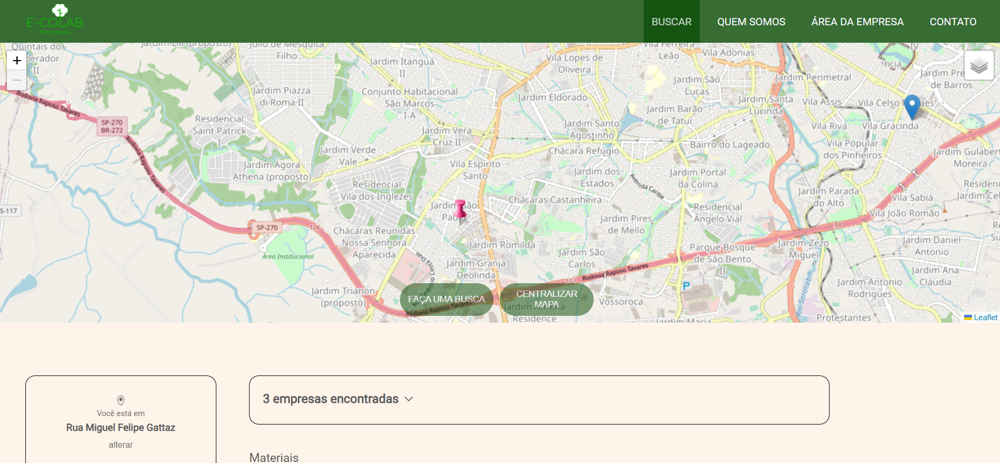
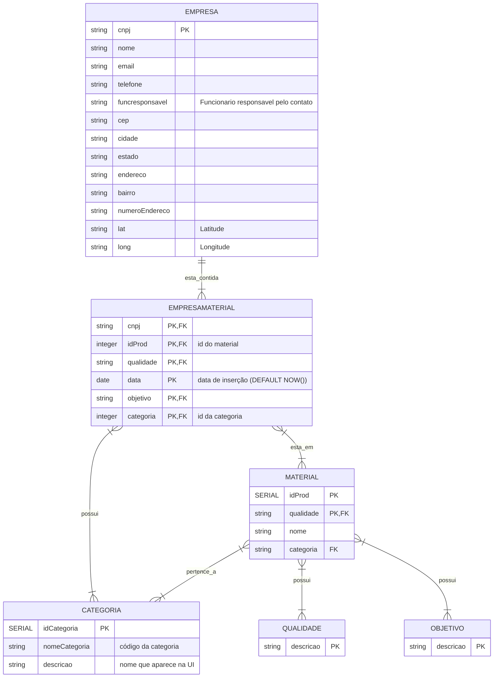

# E-Colab Empresas
<fig>

<figcaption>Tela de busca com a localização do usuário e a marcação no mapa da empresa encontrada</figcaption>
</fig>

## Inicialização
* No diretório <mark>ecoponto/api</mark>, execute `npm i` para instalar os pacotes referentes ao *back-end*. Para iniciar o *back-end*, utilize `npm start`.
    * As credenciais presentes no arquivo `.env` serão utilizadas.
* No diretório <mark>ecoponto/app</mark>, execute `npm i` para instalar os pacotes referentes ao *front-end*. Para iniciar o *front-end*, utilize `npm run serve`.
    * As credenciais presentes no arquivo `.env.development.local` serão utilizadas.

## Deploy
* *Back-End*: copie os arquivos, exceto a pasta `node_modules` para o servidor no diretório especificado no arquivo do Drive.
    * Verifique se as credenciais presentes no arquivo `.env` correspondem ao ambiente de produção.
* *Front-End*: execute o comando `npm run build` e copie a pasta `dist` para o diretório especificado no arquivo do Drive no servidor.
    * As credenciais presentes no arquivo `.env.production.local` serão inseridas nos arquivos da pasta `dist`. Verifique se correspondem ao ambiente de produção.
* No servidor, execute o comando `pm2 reload 0`. É possível executar `pm2 logs` em seguida para verificar se o serviço foi reinicializado corretamente.


Para executar o projeto, utilize as ferramentas descritas na sessão *Ferramentas*.

## Ferramentas
As versões específicadas foram utilizadas durante o desenvolvimento do projeto.
* [NodeJS](https://nodejs.org/en) - 16.20.1
* [Vue.js](https://vuejs.org/) - Vue 3
* [PostgreSQL](https://www.postgresql.org/) - 14.8
* [PostGIS](https://postgis.net/) - 3.3.3


## Links importantes
* [NodeJS + Express API](https://medium.com/xp-inc/https-medium-com-tiago-jlima-developer-criando-uma-api-restful-com-nodejs-e-express-9cc1a2c9d4d8) -  Criando uma API RESTful com NodeJS e Express.
* [Logística Reversa](https://www.sinir.gov.br/perfis/logistica-reversa/) - 
Como funciona?
# E-Colab Empresas

## Introdução

Inicialmente nomeado de Ecoponto, o E-Colab Empresas é uma plataforma web que assessora a gestão de resíduos sólidos promovendo a sua destinação adequada, incentivando a Economia Circular, através da Logística Reversa.

O intuito é permitir o cadastro de empresas e facilitar a interação entre aquelas interessadas em comprar, vender, doar ou coletar os resíduos de produtos e/ou matérias primas.

Pertencentes ao Centro de Ciências em Gestão e Tecnologia (CCGT) da Universidade Federal de São Carlos - campus Sorocaba, o grupo reúne pesquisadores e estudantes de diferentes formações e áreas de conhecimento, interessados em proteger o meio ambiente, a partir da disseminação da informação, de ações educativas e de orientação à comunidade em geral alinhadas aos objetivos de desenvolvimento sustentável da ONU. O nosso grupo tem como propósito específico o estudo e desenvolvimento de métodos e práticas para promover a Logística Reversa e a Economia Circular.

## Análise técnica

### Descrição do ambiente técnico

O sistema é composto por um banco de dados, uma interface web e um servidor onde o *back-end* é executado. Funcionalidades principais:

* **F1** - Cadastro de empresas.
* **F2** - Cadastro de materiais.
* **F3** - Recuperar materiais.
* **F4** - Alterar localização inicial.

As ferramentas utilizadas para o desenvolvimento incluem NodeJS, que é um ambiente de JavaScript utilizado para o *back-end*, para *front-end* foi utilizado Vue 3 e PostgreSQL com a extensão PostGIS atuando como sistema gerenciador de banco de dados relacional.

### Levantamento de requisitos  
Inicialmente foi definido que as empresas devem estar cadastradas para registrar seus materiais. Devem cadastrar os resíduos que possuem e pesquisar por outras empresas a partir de categoras de resíduos, objetivo, qualidade e distância.
### Requisitos Funcionais
Respeitando a proposta, o sistema deverá atender os seguintes requisitos:

* **RF1** - Empresa se cadastra informando os dados necessários.
* **RF2** - Empresa cadastra os materiais que deseja.
* **RF3** - Empresa busca por materiais selecionando os filtros na tela.

## Regras de Negócio

**RGN1** -  A empresa só irá cadastrar seus resíduos se estiver cadastrada no sistema.  

**RGN2** -  Os materiais só são registrados caso sejam inseridos por uma empresa.

**RGN3** -  Os materiais resultantes da busca estão de acordo com os filtros selecionados.

**RGN4** -  Os filtros de categoria são:
* Pedras, pedriscos, minério
* Produtos agrícolas ou alimentos
* Madeira, painéis, mobiliário e papel
* Produtos de couro e têxtil
* Produtos derivados de petróleo, gás natural e carvão
* Produtos químicos inorgânicos
* Produtos químicos orgânicos
* Revestimentos (tintas, vernizes, colas vedantes)
* Equipamentos fotográficos
* Resíduo oriundo de processos térmicos
* Produtos químicos e revestimentos de metais
* Metais e plásticos
* Óleos e resíduos de combustíveis
* Solventes, fluídos de refrigeração e gases propulsores orgânicos
* Embalagens, panos, vestuário de proteção
* Outros
* Produtos de construção e demolição
* Produtos de saúde
* Instalações de gestão de resíduos, de estações de tratamento de águas residuais
* Sólidos urbanos e equipamentos (domésticos, comércio, indústria)
* Resíduos eletrônicos

**RGN5** -  Os filtros de objetivo são:
* Comprar
* Vender
* Doar
* Coletar

**RGN6** -  Os filtros de qualidade são:
* Prensado
* Limpo
* Inteiro
* Cacos
* Unidade
* Triturado
* Sujo

## Banco de Dados


### Mensagens internas

| Nome | Funcionalidade|
|------|--------------|
|```GET``` /categorias|Lista todas categorias registradas no banco.|
|```POST``` /categorias|Insere uma nova categoria.|
|```GET``` /empresa|Lista a empresa de acordo com o cnpj passado no corpo do objeto.|
|```POST``` /empresas|Insere uma nova empresa.|
|```GET``` /empresamaterial|Retorna o resultado da tabela que contém cnpj da empresa e a relação de materiais da mesma, de acordo com o cnpj passado no corpo do objeto.|
|```POST``` /alterarlocal|Altera coordenada inicial do mapa.|
|```GET``` /material|Lista materiais de acordo com os filtros passados.|
|```GET``` /material|Insere um novo material.|
|```GET``` /objetivos|Lista os objetivos cadastrados.|
|```POST``` /objetivos|Insere um novo objetivo.|
|```GET``` /qualidades|Lista as qualidades cadastradas.|
|```POST``` /qualidades|Insere uma nova qualidade.|