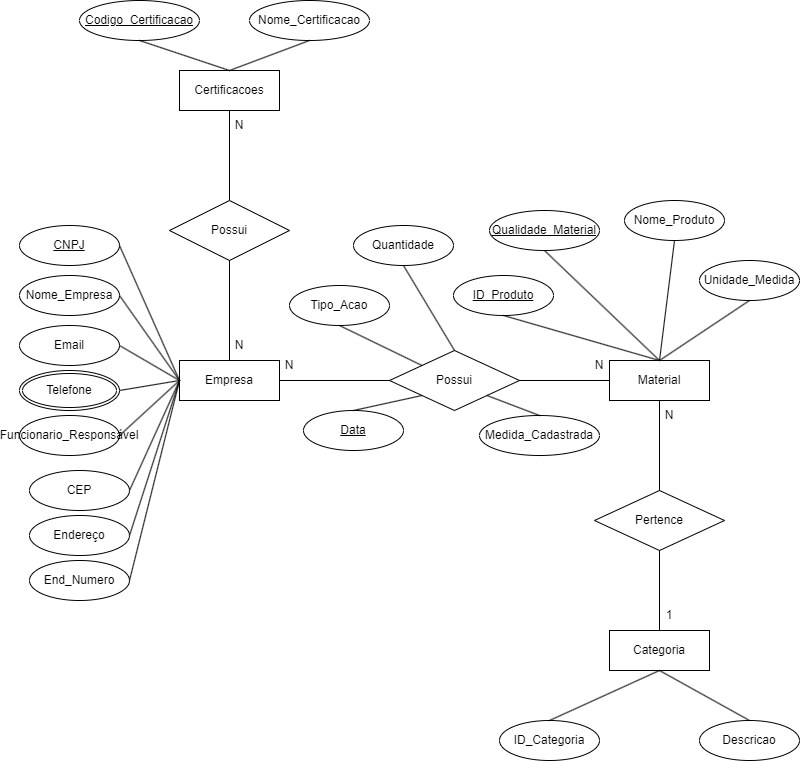

# ecoponto-back

Name        | Version
---         | ---
PostgreSQL  | 12.11
Node        | v16.15.1

```bash
npm install nodemon --save-dev
npm install express ejs pg dotenv sequelize node-geocoder cors --save
```

# MER


# DER
